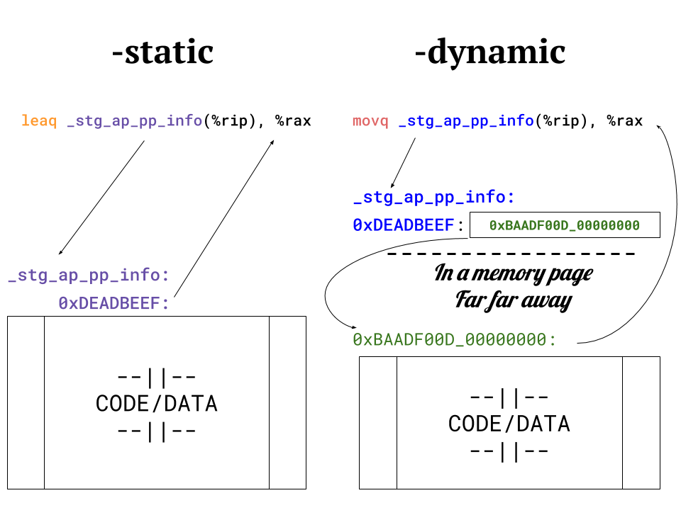
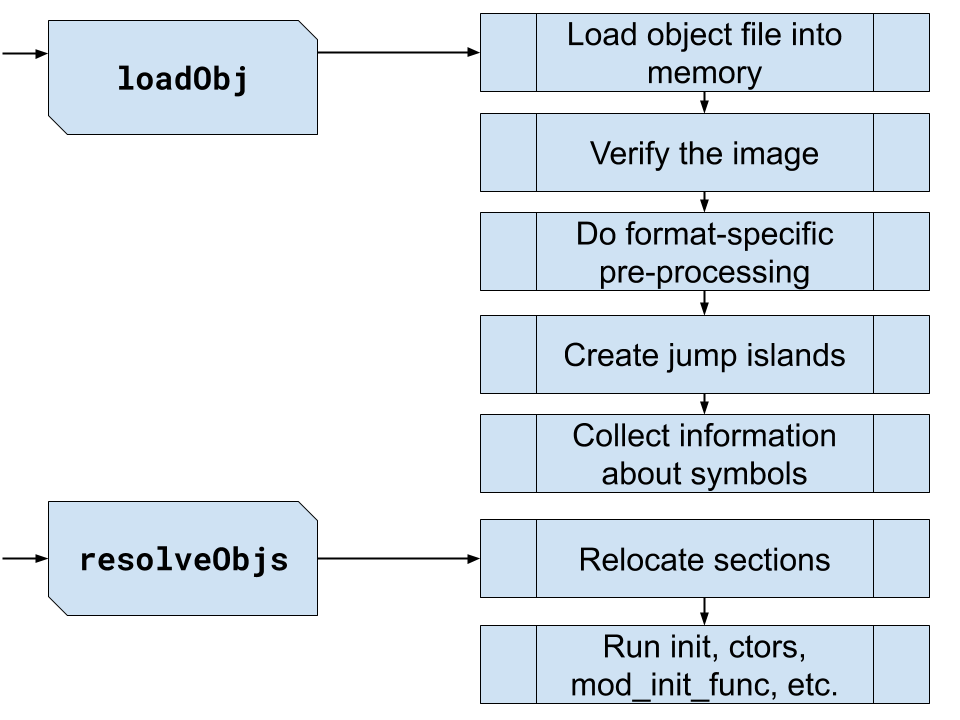

slidenumbers: true


#[fit] GHC Runtime **Linker**
###                                                              *by Example*

[.footer: Artem Pianykh, @artem_pyanykh]

---


---


---

#[fit] GHC**i**   :arrow_left: Byte Code :arrow_left: Source Code
#[fit] _____ :arrow_upper_left:? **Compiled Code** :arrow_lower_left:_____
## Do we even need **both**?

---

```haskell
module FibSlow where

fib :: Int -> Int
fib 0 = 1
fib 1 = 1
fib n = fib (n - 1) + fib (n - 2)
```

---

# GHC**i**

[.code-highlight: 2-4,6]
[.code-highlight: 7-8,10]

```haskell
λ> :set +s
λ> :load *haskell/FibSlow
[1 of 1] Compiling Fib    ( haskell/FibSlow.hs, interpreted )
λ> fib 35
9227465
(7.14 secs, 4,897,229,624 bytes)
λ> :load haskell/FibSlow
λ> fib 35
9227465
(0.50 secs, 2,150,044,856 bytes)
```

---

#[fit] We will **cover**

<br/>

- What is **linking** in general
- GHC + `-dynamic` and using **system linker**
- GHC + `-static` and custom **RTS linker**
- What are the **challenges**

---

#[fit] `ld` = **l**ink e**d**itor

---

`file:c/magic.c`

```c
int MAGIC = 42;

int magic(int x)
{
        return x + MAGIC;
}
```

---

[.code-highlight: none]
[.code-highlight: 3,6]
[.code-highlight: 6,12,16]
```
c/magic.o:
(__TEXT,__text) section
_magic:
       0:	55 	pushq	%rbp
       1:	48 89 e5 	movq	%rsp, %rbp
       4:	03 3d 00 00 00 00 	addl	_MAGIC(%rip), %edi
       a:	89 f8 	movl	%edi, %eax
       c:	5d 	popq	%rbp
       d:	c3 	retq

SYMBOL TABLE:
0000000000000010 g       __DATA,__data	_MAGIC
0000000000000000 g     F __TEXT,__text	_magic

Contents of (__DATA,__data) section
0000000000000010	2a 00 00 00
```

---

```
4:	03 3d 00 00 00 00 	addl	_MAGIC(%rip), %edi
```

|Bytes     | Value                 | Meaning |
|----------|-----------------------|---------|
| 1        | `03`                  | `ADD` opcode |
| 2        | `3D = b00_111_101`    | addressing mode + register |
| 3-6 (4)  | 0 stub                | 32bit offset from `%rip` |

---

```
4:	03 3d 00 00 00 00 	addl	_MAGIC(%rip), %edi
```

```
                         ==
```

```
4:	03 3d ?? ?? ?? ?? 	addl	_MAGIC(%rip), %edi
```

---

[.code-highlight: 6,15,17]
```
c/magic.o:
(__TEXT,__text) section
_magic:
       0:	55 	pushq	%rbp
       1:	48 89 e5 	movq	%rsp, %rbp
       4:	03 3d 00 00 00 00 	addl	_MAGIC(%rip), %edi
       a:	89 f8 	movl	%edi, %eax
       c:	5d 	popq	%rbp
       d:	c3 	retq

SYMBOL TABLE:
0000000000000010 g       __DATA,__data	_MAGIC
0000000000000000 g     F __TEXT,__text	_magic

Relocation information (__TEXT,__text) 1 entries
address  pcrel length extern type    scattered symbolnum/value
00000006 True  long   True   SIGNED  False     _MAGIC
```

---

`file:c/array_magic.c`

```c
extern int magic(int);

void array_magic(int* arr, int len)
{
        for (int i = 0; i < len; i++) {
                arr[i] = magic(arr[i]);
        }
}
```

---

```c
void array_magic(int* arr, int len); // rdi <- arr; esi <- len
```

[.code-highlight: 2,11,20,23]
```
(__TEXT,__text) section
_array_magic:
...
       a:	85 f6 	testl	%esi, %esi
       c:	7e 27 	jle	0x35
       e:	49 89 ff 	movq	%rdi, %r15
      11:	41 89 f6 	movl	%esi, %r14d
      14:	31 db 	xorl	%ebx, %ebx
...
      20:	41 8b 3c 9f 	movl	(%r15,%rbx,4), %edi
      24:	e8 00 00 00 00 	callq	_magic
      29:	41 89 04 9f 	movl	%eax, (%r15,%rbx,4)
      2d:	48 ff c3 	incq	%rbx
      30:	49 39 de 	cmpq	%rbx, %r14
      33:	75 eb 	jne	0x20
      35:	48 83 c4 08 	addq	$8, %rsp

SYMBOL TABLE:
0000000000000000 g     F __TEXT,__text	_array_magic
0000000000000000         *UND*	_magic
Relocation information (__TEXT,__text) 1 entries
address  pcrel length extern type    scattered symbolnum/value
00000025 True  long   True   BRANCH  False     _magic
```

---

```c
void array_magic(int* arr, int len); // rdi <- arr; esi <- len
```

[.code-highlight: 4-5,16]
[.code-highlight: 6-8]
[.code-highlight: 10-12]
[.code-highlight: 13-15]
```
(__TEXT,__text) section
_array_magic:
---prologue
         a:	85 f6 	testl	%esi, %esi ; length = 0?
-        c:	7e 27 	jle	0x35
|        e:	49 89 ff 	movq	%rdi, %r15  ; r15 <- arr
|       11:	41 89 f6 	movl	%esi, %r14d ; r14 <- length
|       14:	31 db 	xorl	%ebx, %ebx      ; i <- 0
|  ...
|   ->  20:	41 8b 3c 9f 	movl	(%r15,%rbx,4), %edi ; edi <- arr[i]
|  /    24:	e8 00 00 00 00 	callq	_magic          ; eax <- magic(edi)
|  |    29:	41 89 04 9f 	movl	%eax, (%r15,%rbx,4) ; arr[i] <- eax
|  |    2d:	48 ff c3 	incq	%rbx        ; i++
|  |    30:	49 39 de 	cmpq	%rbx, %r14  ; i < length?
\  -    33:	75 eb 	jne	0x20
  ->    35:	48 83 c4 08 	addq	$8, %rsp
---epilogue
```

---

[.code-highlight: 1]
```
c:	7e 27 	jle	0x35
e:	49 89 ff 	movq	%rdi, %r15
...
35:	48 83 c4 08 	addq	$8, %rsp
...
```

- `7e` is opcode for `JLE rel8`
- `JLE` is short (1 byte) jump to `rel8` offset from **next** instruction address
- `e + 27 = 35`

^ Disassembly shows absolute addresses, but jumps in fact are relative.

---

```
24:	e8 00 00 00 00 	callq	_magic
    ^  ^---------
    |           |
    |           32bit 0-stub
    |
    near call, 32bit displacement relative to next instr.
```

[.code-highlight: 3]
```
Relocation information (__TEXT,__text) 1 entries
address  pcrel length extern type    scattered symbolnum/value
00000025 True  long   True   BRANCH  False     _magic
```

---

^Exercise: fill the blanks

`magic.o` and `array_magic.o` combined

[.code-highlight: 2,5,9,13,18]

```
(__TEXT,__text) section
_magic:
       0:	55 	pushq	%rbp
       1:	48 89 e5 	movq	%rsp, %rbp
       4:	03 3d ?? ?? ?? ?? 	addl	_MAGIC(%rip), %edi
       a:	89 f8 	movl	%edi, %eax
       c:	5d 	popq	%rbp
       d:	c3 	retq
_array_magic:
       e:	55 	pushq	%rbp
...
      2e:	41 8b 3c 9f 	movl	_array_magic(%r15,%rbx,4), %edi
      32:	e8 ?? ?? ?? ?? 	callq	_magic
      37:	41 89 04 9f 	movl	%eax, _array_magic(%r15,%rbx,4)
...
      4d:	c3 	retq
Contents of (__DATA,__data) section
0000000000000050	2a 00 00 00
```


---


---

#[fit] -**dynamic**[^~]

[^~]: *dynamic way = haskell libraries and RTS are linked dynamically*

---

```haskell
module Dub
  (dub
  ) where

dub :: Num a => a -> a
dub x = x * x
```

[.code-highlight: 4]
```shell
$ ghc -c Dub.hs # produces Dub.o
$ ghci
λ> :l Dub
... # Will Dub.o get used?
```

---

[.code-highlight: none]
```haskell
module Dub
  (dub
  ) where

dub :: Num a => a -> a
dub x = x * x
```

[.code-highlight: 4]
```
$ ghc -c Dub.hs
$ ghci
λ> :l Dub
[1 of 1] Compiling Dub              ( hs/Dub.hs, interpreted )
Ok, one module loaded.
```

---

# -**dynamic** by default

[.code-highlight: 1,5,7]
```shell
$ objdump -dylibs-used {path-to-ghc-bin}
{path-to-ghc-bin}:
	/usr/lib/libSystem.B.dylib
	@rpath/libHShaskeline-0.7.4.3-ghc8.6.5.dylib
	@rpath/libHSghc-8.6.5-ghc8.6.5.dylib
...
	@rpath/libHSrts_thr-ghc8.6.5.dylib
```

---

[.code-highlight: 1,4]
```shell
$ ghc -c -dynamic Dub.hs
$ ghci
λ> :l Dub
Ok, one module loaded.
Collecting type info for 1 module(s) ...
```

<!-- --- -->

<!-- #[fit] **Compilation** flags vs **linking** options -->
<!-- <br> -->

<!-- | Flag     | Way     | C libs | Haskell libs | -->
<!-- |----------|---------|--------|--------------| -->
<!-- | no       | Vanilla | OS     | .o + RTS     | -->
<!-- | -dynamic | Dynamic | OS     | .dylib + OS  | -->

---


#[fit] `diff -u static/Dub.s dyn/Dub.s`

```
-static/Dub.s:
+dyn/Dub.s:
...
-	leaq	_stg_ap_pp_info(%rip), %rax
+	movq	_stg_ap_pp_info(%rip), %rax
...
-	jmp	_base_GHCziNum_zt_info
+	jmpq	*_base_GHCziNum_zt_info(%rip)
...
```

---

#[fit] `diff -u <(objdump -r static/Dub.o) <(objdump -r dyn/Dub.o)`

```
- X86_64_RELOC_BRANCH _base_GHCziNum_zt_info
- X86_64_RELOC_SIGNED _stg_ap_pp_info
...
+ X86_64_RELOC_GOT _base_GHCziNum_zt_info@GOTPCREL
+ X86_64_RELOC_GOT_LOAD _stg_ap_pp_info@GOTPCREL
```

---



---


# `$ find [ghci]`


## `./compiler/ghci`
## `./libraries/ghci`

---

^ High-level linking stuff:
^ Linker state, linker initialisation, byte code linking, object
^ code dynamic linking, loading and unloading of modules and packages.

[.code-highlight: 1,10,11]
```
compiler/ghci
├── ByteCodeAsm.hs
├── ByteCodeGen.hs
├── ByteCodeInstr.hs
├── ByteCodeItbls.hs
├── ByteCodeLink.hs
├── ByteCodeTypes.hs
├── Debugger.hs
├── GHCi.hs
├── Linker.hs
├── LinkerTypes.hs
├── RtClosureInspect.hs
└── keepCAFsForGHCi.c
```


|             | files | blank | comment | code |
|-------------|-------|-------|---------|------|
| `Linker.hs` | 1     | 262   | 422     | 1002 |
| Total       | 11    | 1031  | 1735    | 4703 |

---

`file:Linker.hs`

[.code-highlight: 1,8,9]
```haskell
dynLinkObjs hsc_env pls objs = do
        -- Load the object files and link them
        let (objs_loaded', new_objs) = rmDupLinkables (objs_loaded pls) objs
            pls1                     = pls { objs_loaded = objs_loaded' }
            unlinkeds                = concatMap linkableUnlinked new_objs
            wanted_objs              = map nameOfObject unlinkeds

        if interpreterDynamic (hsc_dflags hsc_env)
            then do pls2 <- dynLoadObjs hsc_env pls1 wanted_objs
                    return (pls2, Succeeded)
            else do mapM_ (loadObj hsc_env) wanted_objs
                    -- Link them all together
                    ok <- resolveObjs hsc_env
...
```

---

`file:Linker.hs`

[.code-highlight: 1,2,5]
[.code-highlight: 10,11]
[.code-highlight: 15]
```haskell
dynLoadObjs _       pls                           []   = return pls
dynLoadObjs hsc_env pls@PersistentLinkerState{..} objs = do
    let dflags = hsc_dflags hsc_env
    ...
    (soFile, libPath , libName) <- newTempLibName
                                     dflags
                                     TFL_CurrentModule (soExt platform)

    let dflags2 = dflags {..., outputFile = Just soFile }
    -- link all "loaded packages" so symbols in those can be resolved
    linkDynLib dflags2 objs pkgs_loaded

    -- if we got this far, extend the lifetime of the library file
    changeTempFilesLifetime dflags TFL_GhcSession [soFile]
    m <- loadDLL hsc_env soFile
    case m of
        Nothing -> return $! pls { temp_sos = (libPath, libName) : temp_sos }
        Just err -> panic ("Loading temp shared object failed: " ++ err)
```

---
# Example

```haskell
-- file: Dub.hs
module Dub (dub) where

dub x = x * x

-- file: Foo.hs              -- file: Bar.hs
module Foo (foo) where       module Bar (bar) where
import Dub                   import Foo

foo a = dub a + 1            bar a = even $ foo a
```
---

`$ ghc --interactive +RTS -Dl`

[.code-highlight: 3, 5]
```haskell
initLinker: start
...
Prelude> :l Dub Foo Bar
Ok, three modules loaded.
Prelude Dub> :m Dub Foo Bar
Prelude Dub Foo Bar>
```

---

```haskell
Prelude Dub Foo Bar> dub 1
addDLL: dll_name = '[tmp-folder]/libghc_1.dylib'
internal_dlopen: dll_name = '[tmp-folder]/libghc_1.dylib'
...
1
```

---

```haskell
Prelude Dub Foo Bar> foo 2
addDLL: dll_name = '[tmp-forlder]/libghc_3.dylib'
internal_dlopen: dll_name = '[tmp-folder]/libghc_3.dylib'
...
5
```

---

```haskell
Prelude Dub Foo Bar> bar 3
addDLL: dll_name = '[tmp-folder]/libghc_5.dylib'
internal_dlopen: dll_name = '[tmp-folder]/libghc_5.dylib'
...
True
```

---

[.code-highlight: 1, 3, 5, 7, 9, 11, 13]
```
$ PAT='.*F.*\(Dub_dub\|Foo_foo\|Bar_bar\).*'

$ objdump -t libghc_1.dylib | grep $PAT
0000000000000f60 l     F __TEXT,__text	_dsp__Dub_dub_info_dsp
0000000000000f78 g     F __TEXT,__text	_Dub_dub_info

$ objdump -t libghc_3.dylib | grep $PAT
0000000000000f18 l     F __TEXT,__text	_dsp__Foo_foo_info_dsp
0000000000000f30 g     F __TEXT,__text	_Foo_foo_info

$ objdump -t libghc_5.dylib | grep $PAT
0000000000000e80 l     F __TEXT,__text	_dsp__Bar_bar_info_dsp
0000000000000e98 g     F __TEXT,__text	_Bar_bar_info
```

---

```haskell
Prelude Dub Foo Bar> :l Bar
Ok, three modules loaded.
Prelude Bar> bar 4
addDLL: dll_name = '[tmp-folder]/libghc_7.dylib'
internal_dlopen: dll_name = '[tmp-folder]/libghc_7.dylib'
...
False
```

---

[.code-highlight: 1, 5-7]
```
$ objdump -t libghc_7.dylib | grep $PAT
0000000000000ae8 l     F __TEXT,__text	_dsp__Foo_foo_info_dsp
0000000000000b80 l     F __TEXT,__text	_dsp__Dub_dub_info_dsp
0000000000000e68 l     F __TEXT,__text	_dsp__Bar_bar_info_dsp
0000000000000e80 g     F __TEXT,__text	_Bar_bar_info
0000000000000b98 g     F __TEXT,__text	_Dub_dub_info
0000000000000b00 g     F __TEXT,__text	_Foo_foo_info
```

---

```haskell
Prelude Bar> :l Bar
Ok, three modules loaded.
Prelude Bar> bar 5
addDLL: dll_name = '[tmp-folder]/libghc_9.dylib'
internal_dlopen: dll_name = '[tmp-folder]/libghc_9.dylib'
...
True

```

---

[.code-highlight: 1, 5-7]
```
$ objdump -t libghc_9.dylib | grep $PAT
0000000000000ae8 l     F __TEXT,__text	_dsp__Foo_foo_info_dsp
0000000000000b80 l     F __TEXT,__text	_dsp__Dub_dub_info_dsp
0000000000000e68 l     F __TEXT,__text	_dsp__Bar_bar_info_dsp
0000000000000e80 g     F __TEXT,__text	_Bar_bar_info
0000000000000b98 g     F __TEXT,__text	_Dub_dub_info
0000000000000b00 g     F __TEXT,__text	_Foo_foo_info
```

---

[.code-highlight: 1,3,4,5,6,7]
```
$ lsof -c ghc | grep libghc_
CMD     PID   FD      TYPE SIZE/OFF  NAME
ghc     91710 txt      REG     8928  [tmp-folder]/libghc_1.dylib
ghc     91710 txt      REG     9608  [tmp-folder]/libghc_3.dylib
ghc     91710 txt      REG    10420  [tmp-folder]/libghc_5.dylib
ghc     91710 txt      REG    11344  [tmp-folder]/libghc_7.dylib
ghc     91710 txt      REG    11344  [tmp-folder]/libghc_9.dylib
```

---

# `¯\_(ツ)_/¯`

---

#[fit] -**vanilla**[^*]

[^*]: *vanilla way = haskell libraries and RTS are linked statically*

---

`file:Linker.hs`

[.code-highlight: 1,8,11,13]
```haskell
dynLinkObjs hsc_env pls objs = do
        -- Load the object files and link them
        let (objs_loaded', new_objs) = rmDupLinkables (objs_loaded pls) objs
            pls1                     = pls { objs_loaded = objs_loaded' }
            unlinkeds                = concatMap linkableUnlinked new_objs
            wanted_objs              = map nameOfObject unlinkeds

        if interpreterDynamic (hsc_dflags hsc_env)
            then do pls2 <- dynLoadObjs hsc_env pls1 wanted_objs
                    return (pls2, Succeeded)
            else do mapM_ (loadObj hsc_env) wanted_objs
                    -- Link them all together
                    ok <- resolveObjs hsc_env
...
```

---

^ Mostly bindings to RTS linker.

[.code-highlight: 1,8]
```
libraries/ghci/GHCi
├── BinaryArray.hs
├── BreakArray.hs
├── CreateBCO.hs
├── FFI.hsc
├── InfoTable.hsc
├── Message.hs
├── ObjLink.hs
├── RemoteTypes.hs
├── ResolvedBCO.hs
├── Run.hs
├── Signals.hs
├── StaticPtrTable.hs
├── TH
│   └── Binary.hs
└── TH.hs
```

|              | files | blank | comment | code |
|--------------|-------|-------|---------|------|
| `ObjLink.hs` | 1     | 27    | 45      | 123  |
| Total        | 12    | 292   | 414     | 1437 |


---

[.code-highlight:1,2,3,4]
[.code-highlight: all]
```
rts
├── Linker.c
├── LinkerInternals.h
└── linker
   ...
   ├── ELFRelocs                          ├── elf_compat.h
       ...
   ├── Elf.c                              ├── elf_got.c
   ├── Elf.h                              ├── elf_got.h
   ├── ElfTypes.h                         ├── elf_plt.c
   ├── LoadArchive.c                      ├── elf_plt.h
   ├── M32Alloc.c                         ├── elf_plt_aarch64.c
   ├── M32Alloc.h                         ├── elf_plt_aarch64.h
   ├── MachO.c                            ├── elf_plt_arm.c
   ├── MachO.h                            ├── elf_plt_arm.h
   ├── MachOTypes.h                       ├── elf_reloc.c
   ├── PEi386.c                           ├── elf_reloc.h
   ├── PEi386.h                           ├── elf_reloc_aarch64.c
   ├── PEi386Types.h                      ├── elf_reloc_aarch64.h
   ├── SymbolExtras.c                     ├── elf_util.c
   ├── SymbolExtras.h                     ├── elf_util.h
   └── util.h
```

---

#[fit] **RTS linker** stats

<br/>

| Language | files | blank | comment | code     |
|----------|-------|-------|---------|----------|
| C        | 15    | 1247  | 1977    | **6810** |
| C Header | 19    | 217   | 265     | **710**  |


---

# Linker C interface


[.code-highlight: 10,14]
```
initLinker_

addLibrarySearchPath
removeLibrarySearchPath
findSystemLibrary

addDLL

loadArchive
loadObj
purgeObj
unloadObj

resolveObjs

lookupSymbol
```

---



---

#[fit] What is the
#[fit] **problem**?[^=]

[^=]: ... apart from needing to deal with 10 kLOC of involved C that is hard to get right.

---

[.footer: :copyright: HorsePaintings]


#[fit] **BUGS**
<br><br><br>

---

**Example 1:**

```c
int
ocGetNames_MachO(ObjectCode* oc) // oc was mmapped earlier
{
    // within for-loop over object code (oc) sections
    section_64 *section = &oc->info->macho_sections[i];
    // for section of type ZEROFILL
    zeroFillArea = mmap(section->size, MAP_ANONYMOUS, -1, 0);
    // check mmap
    section->offset = zeroFillArea - oc->image;
    //...
}
```

---

**Example 1:**

[.code-highlight: 8,13,14]
```c
int
ocGetNames_MachO(ObjectCode* oc) // oc was mmapped earlier
{
    // within for-loop over object code (oc) sections
    section_64 *section = &oc->info->macho_sections[i];
    // for section of type ZEROFILL
    zeroFillArea = mmap(section->size, MAP_ANONYMOUS, -1, 0);
    section->offset = zeroFillArea - oc->image;
    //...
}

// MacOS SDK/mach-o/loader.h
struct section_64 {
	uint32_t	offset;		/* file offset of this section */
};
```

---

# **What if**...
## the kernel allocates
## a page **before**
## `oc->image`[^?]

[^?]: unsigned integer underflow and segfault down the road

---

**Example 2:**

[.code-highlight: all]
[.code-highlight: 14,15]
```c
int
ocBuildSegments_MachO(ObjectCode *oc)
{
        size_t size_[xx]Segment = 0; //xx = rx, rw, zerofill

        for (int i = 0; i < oc->n_sections; i++) {
                MachOSection *macho = &oc->info->macho_sections[i];
                size_t alignment = 1 << macho->align;

                size_[xx]Segment = roundUpToAlign(size_[xx]Segment, alignment);
                size_[xx]Segment += macho->size;
        }

        size_compound = roundUpToPage(size_[xx]Segment) + ...;
        mem = mmap(size_compound, MAP_ANON, -1, 0);
        //...
}
```

---

# **What if**...
## **all** sections in
## the object file
## are **empty**[^??]

[^??]: [GHC-16701](https://gitlab.haskell.org/ghc/ghc/issues/16701) -- `mmap 0 bytes at 0x0`


---

#[fit] **Bigger** issue
##[GHC-13624](https://gitlab.haskell.org/ghc/ghc/issues/13624)[^!]
#[fit] `loadObj()` does not respect **alignment**

[^!]: Not fixed yet :sob:

---

#[fit] _Unlucky_ **SSE** instruction
# =
# `SIGBUS` :skull:

---


#               Recap

---

# [fit] Thanks for your
# [fit] attention!
# <br/>
# [fit] **Questions?**

```
-- speaker: Artem Pianykh
-- twitter: @artem_pyanykh
```


